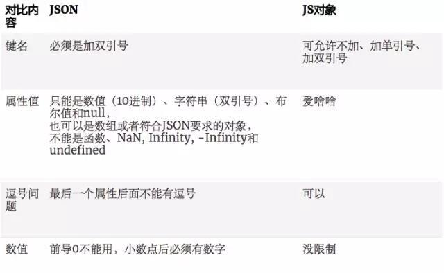

##JSON浅谈

###1.JSON简介

#####1.1JSON是什么？

JSON(Javascript Object Notation)全称是javascript对象表示法，它是一种**数据交换**的文本格式（轻量级（Light-Weight）、 基于文本的 （Text-Based）、 可读的 （Human-Readable）格式），而不是一种编程语言（虽然具有和JavaScript相同的语法形式，但是JSON并不属于JavaScript），用于读取结构化数据。


#####1.2JSON的语法
- 简单值   
  + 使用与JavaScript相同的语法，可以在JSON中表示字符串，数值，布尔值和null，但是JSON不支持JavaScript中的特殊值undefined

```javascript

	//合格的简单值
	5
	"hello world"
	true
	null

	//不合格的简单值
	+0x1
	'hello world'
	undefined
	NaN
	Infinity
```

+ JavaScript字符串与JSON字符串最大的区别在于，JSON字符串必须使用双引号（单引号会导致语法错误）

  - 对象

  ```javascript
  	
  	//合格的对象
  	{
  	    "name":"huochai",
  	    "age":29,
  	    "school":{
  	        "name":"diankeyuan",
  	        "location":"beijing"
  	    }
  	}
  	
  	//不合格的对象
  	{ name: "张三", 'age': 32 }//属性名必须使用双引号
  	{};//不需要末尾的分号
  	{ "birthday": new Date('Fri, 26 Aug 2011 07:13:10 GMT'),
  	  "getName": function() {
  	      return this.name;
  	  }
  	} // 不能使用函数和日期对象
  ```

  与JavaScript的对象字面量相比。JSON没有声明变量；没有末尾的分号；对象的键名及属性值必须加上**双引号**（而不是单引号或者不加引号）。

-  数组

   ```javascript

    	  //合格的数组
    	  ["zhangsan","lisi"]
    	  //不合格的数组
    	  ['1989','2001',]//属性名必须使用双引号,末尾不能加逗号

   ```

   总的来说JSON格式和JS对象语法上的区别有以下几点：

  

可以看到，相对于JS对象，JSON的格式更严格，所以大部分写的JS对象是不符合JSON的格式的。


#####1.3JSON 和 XML

- 相比 XML，JSON 的优势如下：

  + 没有结束标签，长度更短，读写更快
  + 能够直接被 JavaScript 解释器解析
  + 可以使用数组

- 下面是描述同样信息的 XML 文件和 JSON 文件，来看看区别。   


```javascript

	//JSON:
	{
	  name:"lizongji",
	  year:2017,
      friends:["xiaoming","xiaohong","xiaoxing"]
	}

```

```HTML

	//XML:
	<root>
		<name>lizongji</name>
		<year>2017</year>
		<friends>xiaoming</friends>
		<friends>xiaohong</friends>
		<friends>xiaoxing</friends>
	</root>
```

可以看到，描述同样的信息，XML 更加麻烦，而 JSON 要轻巧得多，在有数组出现的情况下更加明显。而且，当数组项很多的时候，XML 文件中的大量信息都被用于描述没什么用的标签上了。　


