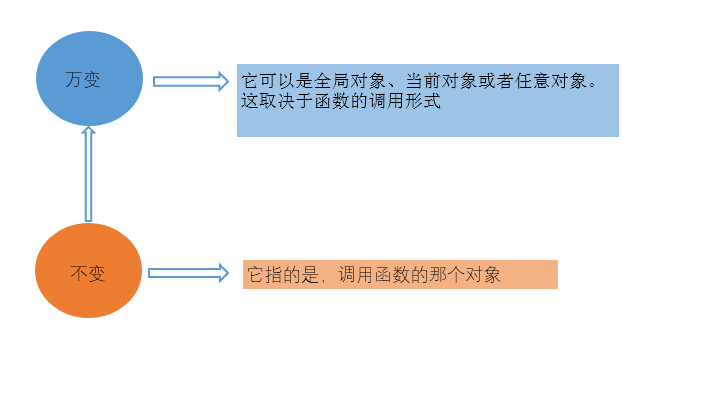

## arguments与this
#### 一、arguments
##### 1.Javascript并没有重载函数的功能，但是Arguments对象能够模拟重载。 
##### 2.Javascrip中的每个函数都会有一个Arguments对象实例arguments，它引用着函数的实参，可以用数组下标的方式"[]"引用arguments的元素。
 - arguments.length为函数实参个数。
 
 - arguments.callee引用函数自身。详情见：[http://www.jianshu.com/p/a426979b9605](http://www.jianshu.com/p/a426979b9605) 
 
 - arguments.callee.length判断形参个数
 
	    function test() {
	    var s = '';
	    for (i = 0; i < arguments.length; i++) {
	        s += arguments[i] + ",";
	    }
	    console.log(arguments.length);
	    console.log(arguments.callee);
	    return s;
		}
	    test("name", "age")

### 二、this
   
  
