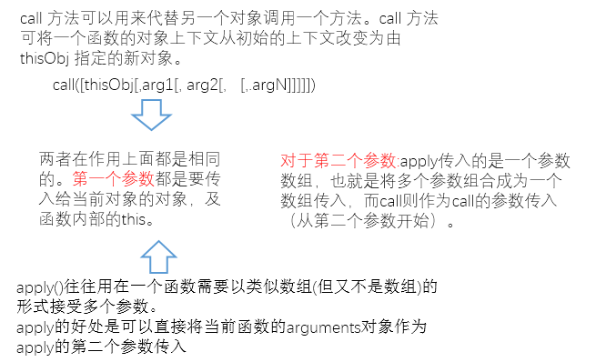

## call/apply的用法
  
#### 实例:
    //1、call/apply常规用法

	function add(a,b)
		{
		    console.log('a+b='+(a+b));
		}
	function sub(a,b)
		{
		    console.log('a-b='+(a-b));
		}
	
	add.call(sub,3,1);
	add.apply(sub,[3,1])

    //2、call、apply实现继承

	    function Animal(name){
	    this.name = name;
	    this.showName = function(){
	        console.log(this.name);
	    }
	}
	function Cat(name){
	    Animal.call(this, name);
	}
	var cat = new Cat("Black Cat");
	cat.showName();