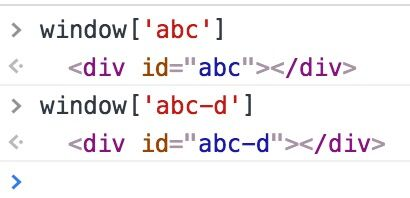

#《编写可维护的javascript》读书笔记
>每个人都有一套编码习惯，在团队协作过程中，需要每个人都遵守统一的编码约定和编程方法，以便团队任何人都可以轻松的理解，修改和扩展你的代码。

####第一部分：编程风格
###一、基本的格式化
#####1、缩进层级

第一种缩进：使用制表符进行缩进。

第二种缩进：使用空格符进行缩进。

推荐：4个空格字符为一个缩进层级，可以在编辑器中配置Tab键插入4个空格。

#####2、语句结局
有时候加没加分号代码可能都会正常运行，没看到这里之前，你可能不知道这是分析器的自动分号插入机制（ASI）在偷偷的帮你干活。
<pre>
function getData() {
        return 
        {
            text: '看看不加分号的后果！'
        }
    }
ASI会解析成下面的样子：
function getData() {
        return ;
        {
            text: '看看不加分号的后果！'
        };
    }
</pre>
所以如果调用上面的getData的方法，返回的就是undefined。尽管没有分号，这段代码工作正常。
<pre>
function getData() {
        return {
            text: '看看不加分号的后果！'
        }
    }
</pre>

#####3、行的长度： 倾向于80个字符。

如果一行多于80个字符，应当在一个运算符（逗号，加号等）后换行。下一行应当增加两级缩进。
<pre>
if (category_id==111111 && task_status.tender_condition.isNewSecurity &&
		$task_os_type == 1) {
	func();
}
</pre>

#####4、命名
JavaScript一般使用驼峰命名法来给变量和函数命名。变量命名前缀一般是名词，函数名前缀一般是动词。（以大写字母开始叫大驼峰,以小写字母开始，之后的单词首字母大写叫小驼峰，构造函数命名遵照大驼峰命名法）
<pre>
var MAX_PRICE = 18, //常量值初始化后就不变了
	myName = "wahaha",
	myAge = 20;//变量的值是可变的
function getName(){
	myAge==MAX_PRICE?console.log(myName):console.log("sorry");
}
</pre>

###二、注释

#####1、单行注释

单行注释有三种使用方法：

独占一行的注释，用来解释下一行代码。这行注释之前总要有一个空行，且缩进层级和下一行码保持一致。
<pre>
// 好的写法
function print(){

	// 控制台输出数字1
	console.log(1);
}
</pre>

#####2、多行注释

多行注释之前也应该有一个空行，且缩进层级和其描述的代码保持一致。

#####3、文档注释

多行注释以单斜线加双星号（/**）开始，接下来是描述信息，其中使用@符号来表示一个或多个属性。

###三、避免“空比较”
#####1、检测原始值
JavaScript有5中简单的原始类型：字符串、数字、布尔值、null和undefined。最佳的选择是用typeof运算符，返回一个值的类型的字符串。
用typeof检测一下4种原始值类型是非常安全的。
<pre>
//检测字符串
if (typeof name === "string") {
  anotherName = name.substring(3);
}
//检测数字
if (typeof count === "number") {
  updateCount(count)；
}
//检测布尔值
if (typeof found === "boolean" && found){ 
  message("Found!");
}
//检测underfined
if (typeof MyApp=== "undefined") {
  MyApp = {};
}
</pre>

#####2、检测引用值
引用值也称为对象，检测某个引用值的类型的官方最好的方法是使用instanceof运算符。但是它不仅检测构造这个对象的构造器，还检测原型链。因为每个对象都继承自Object，因此每个对象的 value instanceof Object都会返回true。
<pre>
var now = new Date();
console.log(now instanceof object); // true
console.log(now instanceof Date) // true
</pre>

#####3、检测数组
<pre>
function isArray(value) {
  return Object.prototype.toString.call(value) === "[object Array]";
}

// ECMAScript6:Array.isArray()
</pre>

###四、函数
+ 推荐总是先声明后使用，和变量声明一样
+ 匿名函数可以在最后加一对小括号来立即执行并返回一个值，然后将这个值赋值给变量
	<pre>
	var val = (function() {
		return "abc";
	}());
	</pre>
+ 避免意外的全局变量
###五、事件处理
+ 隔离应用逻辑
<pre>
var aa = {
	aa1: function(){
		return 123;
	},
	aa2: function(){
		console.log(this.aa1());
	}
};
</pre>

###六、抽离配置数据
配置数据是应用中写死的值。
<pre>
var config={
	U_ID:"123",
	U_URL:"http://www.baidu.com"
};
function validate(val){
	if(config.U_ID==val){
		console.log(config.U_URL);
	}
}
</pre>

**问题讨论：**html标签里的ID在javascript中都是全局变量

	

	

所以建议用类名.J-send-sj这种

	

