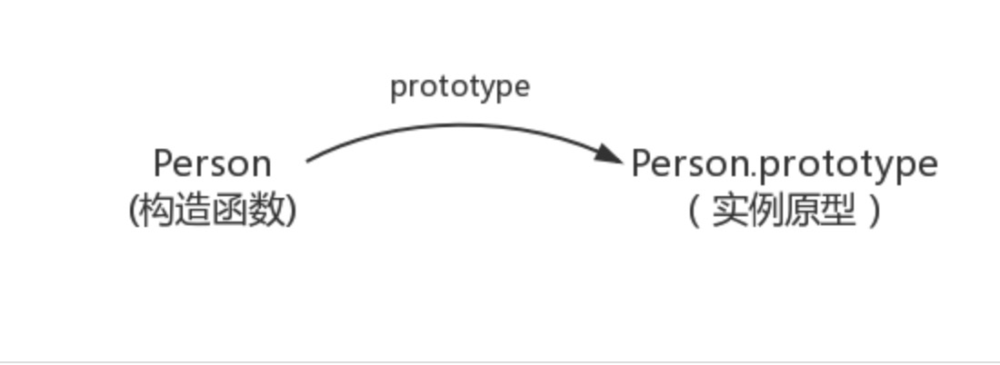

## js对象属性解析

js中所有的食物都是对象，比如String、Date、Array 等等。
对象只是带有属性和方法的特殊数据类型。

### 1 创建对象

	function Person() {
	
	}
	var person = new Person();
	person.name = 'name';
	console.log(person.name) // name
	
### 2 prototype

每个函数都有一个prototype属性，就是我们经常在各种例子中看到的那个prototype

	
	function Person() {
	
	}
	
	// prototype是函数才会有的属性
	Person.prototype.name = 'name';
	var person1 = new Person();
	var person2 = new Person();
	console.log(person1.name) // name
	console.log(person2.name) // name
	
那这个函数的prototype属性到底指向的是什么呢？是这个函数的原型吗？

其实，函数的prototype属性指向了一个对象，这个对象正是调用该构造函数而创建的实例的原型,也就是这个例子中的person1和person2的原型。

那么什么是原型呢？你可以这样理解：每一个JavaScript对象(null除外)在创建的时候就会与之关联另一个对象，这个对象就是我们所说的原型，每一个对象都会从原型"继承"属性。

在这张图中我们用Object.prototype表示实例原型

那么我们该怎么表示实例与实例原型，也就是person和Person.prototype之间的关系呢，这时候我们就要讲到第二个属性：
### 3   _proto_
这是每一个JavaScript对象(除了null)都具有的一个属性，叫__proto__，这个属性会指向该对象的原型。

	function Person() {
	
	}
	var person = new Person();
	console.log(person.__proto__ === Person.prototype); //true

__proto__, 绝大部分浏览器都支持这个非标准的方法访问原型，然而它并不存在与Person.prototype中，实际上，它是来自于Object.prototype，与其说是一个属性，不如说是一个getter/setter，当使用obj.__proto__时，可以理解成返回了Object.getPrototypeOf(obj)
	

### 4 实例与原型

当读取实例的属性时，如果找不到，就会查找与对象关联的原型中的属性，如果还查不到，就去找原型的原型，一直找到最顶层为止。

如下：

	function Person() {
	
	}
	
	Person.prototype.name = 'name';
	
	var person = new Person();
	
	person.name = 'name of this person';
	console.log(person.name) // name of this person
	
	delete person.name;
	console.log(person.name) // name
	
	
在这个例子中，我们设置了person的name属性，所以我们可以读取到为'name of this person'，当我们删除了person的name属性时，读取person.name，从person中找不到就会从person的原型也就是person.__proto__ == Person.prototype中查找，幸运的是我们找到了为'name'，但是万一还没有找到呢？原型的原型又是什么呢？

	var obj = new Object();
	obj.name = 'name'
	console.log(obj.name) // name
	
Object.prototype的原型呢，就是null（无中生有）

